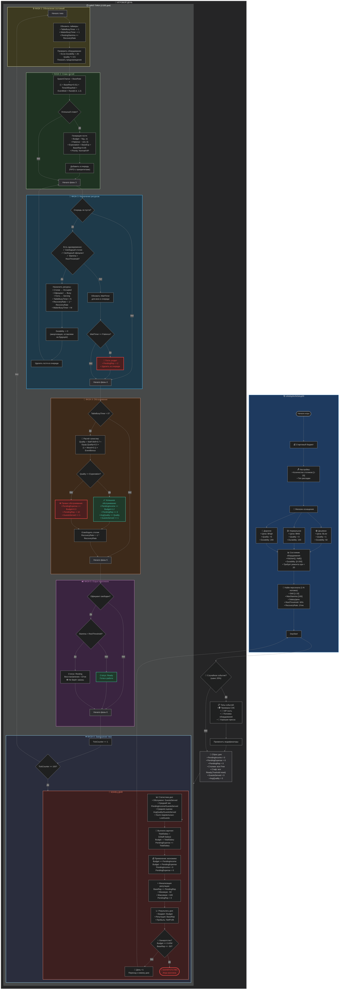

```mermaid
%%{init: {'theme': 'dark', 'themeVariables': {'background': '#1e1e1e', 'primaryColor': '#264f78', 'primaryTextColor': '#d4d4d4', 'primaryBorderColor': '#569cd6', 'lineColor': '#858585', 'secondaryColor': '#3c3c3c', 'tertiaryColor': '#2d2d30'}}}%%
flowchart TD
    %% === ИНИЦИАЛИЗАЦИЯ ===
    subgraph Init["🏗️ ИНИЦИАЛИЗАЦИЯ"]
        Start([Начало игры]) --> Budget[💰 Стартовый бюджет]
        Budget --> SetupTables["🪑 Настройка:\n• Количество столиков [1-20]\n• Тип рассадки"]
        SetupTables --> Shop[🛒 Магазин оснащения]
        
        Shop --> TierCheap["🟢 Дешёвое\n• Цена: $Low\n• Quality: +1\n• Durability: 50"]
        Shop --> TierMid["🟡 Нормальное\n• Цена: $Mid\n• Quality: +3\n• Durability: 100"]
        Shop --> TierExp["🔴 Дорогое\n• Цена: $High\n• Quality: +5\n• Durability: 200"]
        
        TierCheap & TierMid & TierExp --> EquipState["📊 Состояние оборудования:\n• KitchenQ, HallQ\n• Durability: [0-200]\n• Требует ремонта при < 20"]
        
        EquipState --> HireStaff["👥 Найм персонала (1-N человек):\n• Skill [1-10]\n• MaxStamina [100]\n• Salary/день\n• RestThreshold: 30%\n• RecoveryRate: 2/тик"]
        
        HireStaff --> DayStart
    end

    %% === ЦИКЛ ДНЯ ===
    subgraph DayCycle["📅 ИГРОВОЙ ДЕНЬ"]
        DayStart --> DailyEvent{"🎲 Случайное событие?\n(шанс 20%)"}
        DailyEvent -->|Да| EventTypes["📋 Типы событий:\n• 🕵️ Проверка СЭС\n• 👑 VIP-гость\n• 🔧 Поломка оборудования\n• 📰 Хорошая пресса"]
        DailyEvent -->|Нет| ResetDaily
        EventTypes --> ApplyEvent["Применить модификаторы"]
        ApplyEvent --> ResetDaily
        
        ResetDaily["🌅 Сброс дня:\n• PendingIncome = 0\n• PendingExpense = 0\n• PendingRep = 0\n• Столики: все Free\n• Стаф: все Ready(Trashold reset)\n• GuestsServed = 0\n• AvgQuality = 0"]
        
        ResetDaily --> TickLoop

        %% === ЦИКЛ ТИКА ===
        subgraph TickLoop["🕒 ЦИКЛ ТИКА (1/100 дня)"]
            direction TB
            
            %% ФАЗА 1: Обновление таймеров
            subgraph Phase1["⚙️ ФАЗА 1: Обновление состояний"]
                TickStart["Начало тика"] --> UpdateTimers["Обновить таймеры:\n• TableBusyTimer -= 1\n• WaiterBusyTimer -= 1\n• RestingStamina += RecoveryRate"]
                UpdateTimers --> CheckEquipment["Проверить оборудование:\n• Если Durability < 20:\n  Quality *= 0.5\n  Показать предупреждение"]
            end
            
            %% ФАЗА 2: Спавн гостей
            subgraph Phase2["👥 ФАЗА 2: Спавн гостей"]
                CheckEquipment --> SpawnCheck["SpawnChance = BaseRate ×\n(1 + BaseRep×0.01) ×\nTimeOfDayMult ×\nEventMult × Rand(0.8, 1.2)"]
                SpawnCheck --> SpawnGuest{"Успешный спавн?"}
                SpawnGuest -->|Да| GenGuest["Генерация гостя:\n• Budget ~ N(μ, σ)\n• Patience ~ U(3, 8)\n• Expectation = BaseExp + BaseRep×0.05\n• Priority: Normal/VIP"]
                GenGuest --> AddToQueue["Добавить в очередь\n(FIFO с приоритетами)"]
                SpawnGuest -->|Нет| Phase3Start
                AddToQueue --> Phase3Start
            end
            
            %% ФАЗА 3: Назначение ресурсов
            subgraph Phase3["🤝 ФАЗА 3: Назначение ресурсов"]
                Phase3Start["Начало фазы 3"] --> QueueCheck{"Очередь не пуста?"}
                QueueCheck -->|Нет| Phase4Start
                QueueCheck -->|Да| ResourceCheck{"Есть одновременно:\n✓ Свободный столик\n✓ Свободный официант\n✓ Stamina > RestThreshold?"}
                
                ResourceCheck -->|Нет| UpdateWait["Обновить WaitTimer\nдля всех в очереди"]
                UpdateWait --> PatienceCheck{"WaitTimer >= Patience?"}
                PatienceCheck -->|Да| GuestLeave["😤 Гость уходит\n• PendingRep -= 2\n• Удалить из очереди"]
                PatienceCheck -->|Нет| Phase4Start
                GuestLeave --> Phase4Start
                
                ResourceCheck -->|Да| AssignResources["Назначить ресурсы:\n• Столик → Occupied\n• Официант → Busy\n• Гость → Serving\n• TableBusyTimer = N\n• RecoveryRate = -1 * RecoveryRate\n• WaiterBusyTimer = M"]
                AssignResources --> DegradeEquipment["Durability -= 0\n(амортизация, оставляем на будущее)"]
                DegradeEquipment --> RemoveFromQueue["Удалить гостя из очереди"]
                RemoveFromQueue --> Phase3Start
            end
            
            %% ФАЗА 4: Обслуживание
            subgraph Phase4["🍳 ФАЗА 4: Обслуживание"]
                Phase4Start["Начало фазы 4"] --> ServiceCheck{"TableBusyTimer = 0?"}
                ServiceCheck -->|Нет| Phase5Start
                ServiceCheck -->|Да| CalcQuality["📐 Расчёт качества:\nQuality = Staff.Skill×0.7 +\nEquip.Quality×0.3 ×\n(1 + Mood×0.1) ×\nEventBonus"]
                
                CalcQuality --> CompareQuality{"Quality >= Expectation?"}
                CompareQuality -->|Да| SuccessService["✅ Успешное обслуживание:\n• PendingIncome += Budget×1.2\n• PendingRep += 3\n• AvgQuality += Quality\n• GuestsServed += 1"]
                CompareQuality -->|Нет| FailService["❌ Провал обслуживания:\n• PendingExpense += Budget×0.3\n• PendingRep -= 10\n• GuestsServed += 1"]
                
                SuccessService --> ReleaseTable["Освободить столик\n RecoveryRate = -1 * RecoveryRate"]
                FailService --> ReleaseTable
                ReleaseTable --> Phase5Start
            end
            
            %% ФАЗА 5: Отдых и восстановление
            subgraph Phase5["🛋️ ФАЗА 5: Отдых персонала"]
                Phase5Start["Начало фазы 5"] --> StaffCheck{"Официант свободен?"}
                StaffCheck -->|Нет| Phase6Start
                StaffCheck -->|Да| StaminaCheck{"Stamina < RestThreshold?"}
                StaminaCheck -->|Нет| ReadyStaff["Статус: Ready\nГотов к работе"]
                StaminaCheck -->|Да| RestStaff["Статус: Resting\nВосстановление: +2/тик\n⛔ Не берёт заказы"]
                ReadyStaff --> Phase6Start
                RestStaff --> Phase6Start
            end
            
            %% ФАЗА 6: Завершение тика
            subgraph Phase6["⏭️ ФАЗА 6: Завершение тика"]
                Phase6Start["Начало фазы 6"] --> TickCounter["TickCounter += 1"]
                TickCounter --> DayEndCheck{"TickCounter >= 100?"}
                DayEndCheck -->|Нет| TickStart
                DayEndCheck -->|Да| EndOfDay
            end
        end

        %% === КОНЕЦ ДНЯ ===
        subgraph EndOfDay["🌙 КОНЕЦ ДНЯ"]
            EndOfDay --> CalcStats["📊 Статистика дня:\n• Обслужено: GuestsServed\n• Средний чек: PendingIncome/GuestsServed\n• Средняя оценка: AvgQuality/GuestsServed\n• Ушло недовольных: LostGuests"]
            
            CalcStats --> PayStaff["💸 Выплата зарплат:\nTotalSalary = Σ(Staff.Salary)\nBudget -= TotalSalary\nPendingExpense += TotalSalary"]
            
            PayStaff --> ApplyEconomy["💰 Применение экономики:\nBudget += PendingIncome\nBudget -= PendingExpense\nPendingIncome = 0\nPendingExpense = 0"]
            
            ApplyEconomy --> ApplyRep["⭐ Финализация репутации:\nBaseRep += PendingRep\n• Минимум: -50\n• Максимум: +100\nPendingRep = 0"]
            
            ApplyRep --> ShowResults["📈 Результаты дня:\n• Бюджет: Budget\n• Репутация: BaseRep\n• Прибыль: NetProfit"]
            
            ShowResults --> BankruptcyCheck{"💥 Банкротство?\nBudget <= 0 ИЛИ\nBaseRep <= -50?"}
            BankruptcyCheck -->|Да| Bankruptcy(["💀 БАНКРОТСТВО\nИгра окончена"])
            BankruptcyCheck -->|Нет| NextDay["📅 День +1\nПереход к новому дню"]
            NextDay --> DayStart
        end
    end

    %% === СТИЛИ (IDE Dark Theme Palette) ===
    classDef init fill:#1e3a5f,stroke:#569cd6,stroke-width:2px,color:#d4d4d4
    classDef day fill:#252526,stroke:#858585,stroke-width:2px,color:#d4d4d4
    classDef phase1 fill:#3d3a20,stroke:#dcdcaa,stroke-width:2px,color:#dcdcaa
    classDef phase2 fill:#1f3322,stroke:#b5cea8,stroke-width:2px,color:#b5cea8
    classDef phase3 fill:#1e3a4a,stroke:#4fc1ff,stroke-width:2px,color:#9cdcfe
    classDef phase4 fill:#3d2a1a,stroke:#ce9178,stroke-width:2px,color:#ce9178
    classDef phase5 fill:#3a2440,stroke:#c586c0,stroke-width:2px,color:#c586c0
    classDef phase6 fill:#2a2d3d,stroke:#9cdcfe,stroke-width:2px,color:#9cdcfe
    classDef eod fill:#3d1f1f,stroke:#f48771,stroke-width:2px,color:#f48771
    classDef bad fill:#4a1f1f,stroke:#f44747,stroke-width:3px,color:#f44747
    classDef good fill:#1f3a2a,stroke:#4ec9b0,stroke-width:2px,color:#4ec9b0
    classDef neutral fill:#2d2d30,stroke:#858585,stroke-width:2px,color:#d4d4d4
    
    class Init init
    class DayCycle day
    class Phase1 phase1
    class Phase2 phase2
    class Phase3 phase3
    class Phase4 phase4
    class Phase5 phase5
    class Phase6 phase6
    class EndOfDay eod
    class Bankruptcy,GuestLeave,FailService bad
    class SuccessService,ReadyStaff good
    class ResetDaily,TickStart,Phase3Start,Phase4Start,Phase5Start,Phase6Start neutral
```