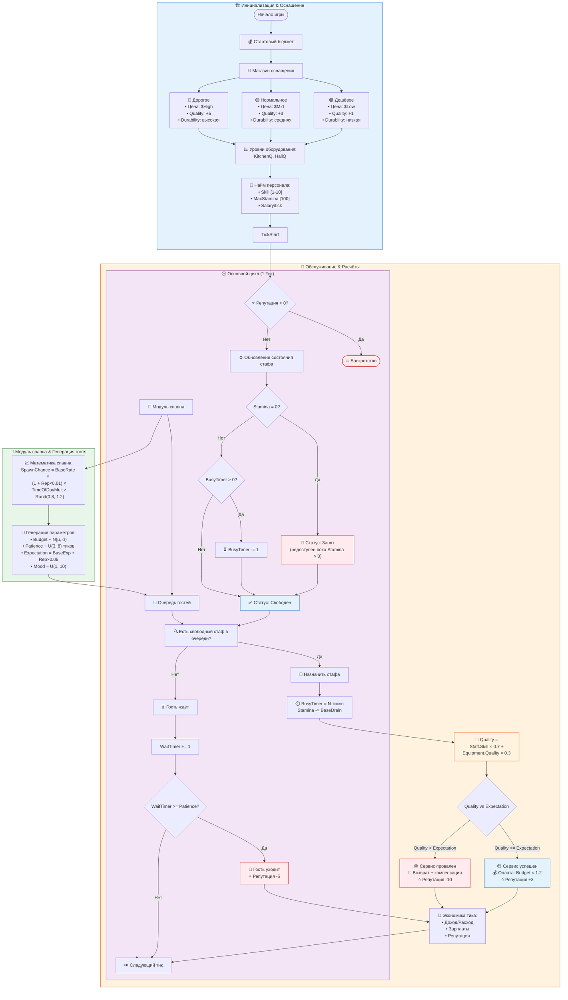

```mermaid
flowchart TD
    %% === ИНИЦИАЛИЗАЦИЯ ===
    subgraph Init["🏗️ Инициализация & Оснащение"]
        Start([Начало игры]) --> Budget[💰 Стартовый бюджет]
        Budget --> Shop[🛒 Магазин оснащения]
        Shop --> TierCheap["🟢 Дешёвое\n• Цена: $Low\n• Quality: +1\n• Durability: низкая"]
        Shop --> TierMid["🟡 Нормальное\n• Цена: $Mid\n• Quality: +3\n• Durability: средняя"]
        Shop --> TierExp["🔴 Дорогое\n• Цена: $High\n• Quality: +5\n• Durability: высокая"]
        TierCheap & TierMid & TierExp --> EquipState["📊 Уровни оборудования:\nKitchenQ, HallQ"]
        EquipState --> HireStaff["👥 Найм персонала:\n• Skill [1-10]\n• MaxStamina [100]\n• Salary/tick"]
        HireStaff --> TickStart
    end

    %% === ГЛАВНЫЙ ЦИКЛ: ТИК ===
    subgraph TickLoop["🕒 Основной цикл (1 Тик)"]
        TickStart --> CheckRep{⭐ Репутация < 0?}
        CheckRep -->|Да| Bankruptcy([💥 Банкротство])
        CheckRep -->|Нет| UpdateStaff["⚙️ Обновление состояния стафа"]
        
        UpdateStaff --> StaminaCheck{Stamina = 0?}
        StaminaCheck -->|Да| ForceBusy["🚫 Статус: Занят\n(недоступен пока Stamina > 0)"]
        StaminaCheck -->|Нет| BusyTimerCheck{BusyTimer > 0?}
        BusyTimerCheck -->|Да| DecBusy["⏳ BusyTimer -= 1"]
        BusyTimerCheck -->|Нет| StaffReady["✅ Статус: Свободен"]
        
        ForceBusy --> StaffReady
        DecBusy --> StaffReady
        
        StaffReady --> AssignCheck["🔍 Есть свободный стаф в очереди?"]
        
        %% Связь с модулем гостей
        SpawnModule[📡 Модуль спавна] --> GuestQueue["🧍 Очередь гостей"]
        GuestQueue --> AssignCheck
        
        AssignCheck -->|Да| Assign["🤝 Назначить стафа"]
        Assign --> SetBusy["⏱️ BusyTimer = N тиков\nStamina -= BaseDrain"]
        
        AssignCheck -->|Нет| WaitLogic["⏳ Гость ждёт"]
        WaitLogic --> IncWait["WaitTimer += 1"]
        IncWait --> LeaveCheck{WaitTimer >= Patience?}
        LeaveCheck -->|Да| GuestExit["😤 Гость уходит\n⭐ Репутация -5"]
        LeaveCheck -->|Нет| NextTick["⏭️ Следующий тик"]
    end

    %% === ОБСЛУЖИВАНИЕ & ЭКОНОМИКА ===
    subgraph ServiceEco["🎯 Обслуживание & Расчёты"]
        SetBusy --> QualityCalc["📐 Quality = \n  Staff.Skill × 0.7 + \n  Equipment.Quality × 0.3"]
        QualityCalc --> Compare{Quality vs Expectation}
        
        Compare -->|Quality >= Expectation| Success["😊 Сервис успешен\n💰 Оплата: Budget × 1.2\n⭐ Репутация +3"]
        Compare -->|Quality < Expectation| Fail["😞 Сервис провален\n💸 Возврат + компенсация\n⭐ Репутация -10"]
        
        Success --> EconTick["💼 Экономика тика:\n• Доход/Расход\n• Зарплаты\n• Репутация"]
        Fail --> EconTick
        GuestExit --> EconTick
        
        EconTick --> NextTick
        NextTick --> TickLoop
    end

    %% === МОДУЛЬ СПАВНА & ГЕНЕРАЦИЯ ===
    subgraph GuestModule["🎲 Модуль спавна & Генерация гостя"]
        SpawnModule --> SpawnMath["📈 Математика спавна:\nSpawnChance = BaseRate × \n  (1 + Rep×0.01) × \n  TimeOfDayMult × \n  Rand(0.8, 1.2)"]
        SpawnMath --> GenParams["👤 Генерация параметров:\n• Budget ~ N(μ, σ)\n• Patience ~ U(3, 8) тиков\n• Expectation = BaseExp + Rep×0.05\n• Mood ~ U(1, 10)"]
        GenParams --> GuestQueue
    end

    %% === СТИЛИ ===
    classDef init fill:#e3f2fd,stroke:#1565c0
    classDef tick fill:#f3e5f5,stroke:#7b1fa2
    classDef guest fill:#e8f5e9,stroke:#2e7d32
    classDef bad fill:#ffebee,stroke:#c62828
    classDef good fill:#e3f2fd,stroke:#1565c0
    classDef eco fill:#fff3e0,stroke:#e65100
    
    class Init init
    class TickLoop tick
    class GuestModule guest
    class Bankruptcy,ForceBusy,Fail,GuestExit bad
    class StaffReady,Success good
    class ServiceEco,QualityCalc,EconUpdate eco
    
```